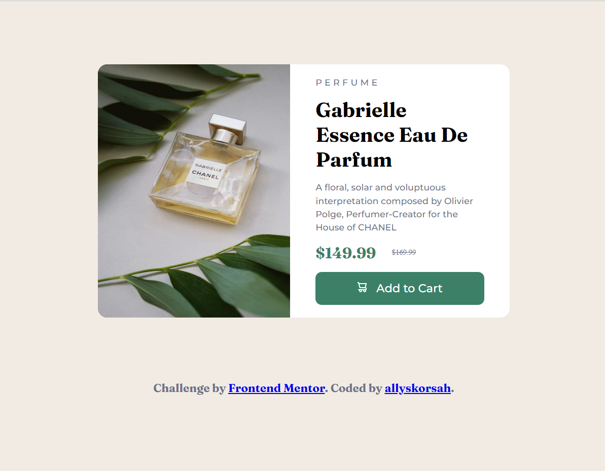

# Frontend Mentor - Product preview card component solution

This is a solution to the [Product preview card component challenge on Frontend Mentor](https://www.frontendmentor.io/challenges/product-preview-card-component-GO7UmttRfa). Frontend Mentor challenges help you improve your coding skills by building realistic projects.

## Table of contents

- [Frontend Mentor - Product preview card component solution](#frontend-mentor---product-preview-card-component-solution)
  - [Table of contents](#table-of-contents)
  - [Overview](#overview)
    - [The challenge](#the-challenge)
    - [Screenshot](#screenshot)
    - [Links](#links)
  - [My process](#my-process)
    - [Built with](#built-with)
    - [What I learned](#what-i-learned)
  - [Author](#author)

## Overview

### The challenge

Users should be able to:

- View the optimal layout depending on their device's screen size
- See hover and focus states for interactive elements

### Screenshot

### Links

- Solution URL: [@allyskorsah](https://www.frontendmentor.io/solutions/product-preview-card-component-design-MNC7n1T3wJ)
- Live Site URL: [allyskorsah.github.io](https://allyskorsah.github.io/Product-Preview-Card-Component-Design/)

## My process

### Built with

- Semantic HTML5 markup
- CSS custom properties
- Flexbox
- CSS Grid

### What I learned

For this project I learned about using an image as a background and what goes into styling it to get desired results.

## Author

- Website - [allyskorsah.github.io](https://allyskorsah.github.io/Product-Preview-Card-Component-Design/)
- Frontend Mentor - [@allyskorsah](https://www.frontendmentor.io/profile/allyskorsah)
